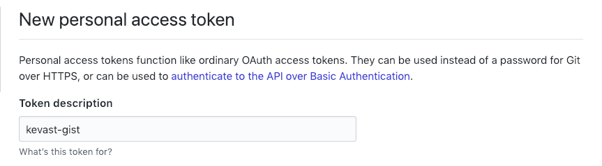
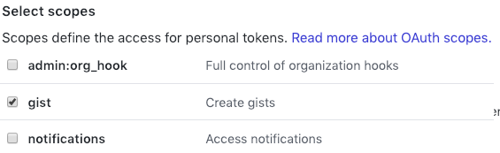
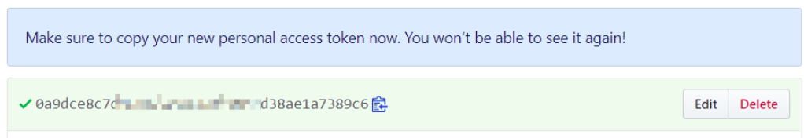

# kevast-gist.js
A [gist](https://gist.github.com/) storage for [kevast.js](https://github.com/kevast/kevast.js).

## Installation
### Node.js
Using yarn
```bash
yarn add kevast-gist
```

Using npm
```bash
npm install kevast-gist
```

### Browser
```html
<script src="https://cdn.jsdelivr.net/npm/kevast-gist/dist/index.min.js"></script>
```

## Usage
Only access token given:
```javascript
const { Kevast } = require('kevast');
const { KevastGist } = require('kevast-gist');
const assert = require('assert');

const ACCESS_TOKEN = 'YOUR GITHUB ACCESS TOKEN';

(async () => {
  const kevastGist = new KevastGist(ACCESS_TOKEN);
  assert(kevastGist.getGistId() === undefined);
  assert(kevastGist.getFilename() === undefined);

  const kevast = await Kevast.create(kevastGist);
  await kevast.set('key', 'value');
  // Generated gist id and filename is available after first 'set' operation
  console.log(kevastGist.getGistId());
  console.log(kevastGist.getFilename());
  assert(kevast.get('key') === 'value');
})();
```

Access token and gist id given:
```javascript
const { Kevast } = require('kevast');
const { KevastGist } = require('kevast-gist');
const assert = require('assert');

const ACCESS_TOKEN = 'YOUR GITHUB ACCESS TOKEN';
const GIST_ID = 'GIST ID';

(async () => {
  const kevastGist = new KevastGist(ACCESS_TOKEN, GIST_ID);
  assert(kevastGist.getGistId() === GIST_ID);
  assert(kevastGist.getFilename() === undefined);

  const kevast = await Kevast.create(kevastGist);
  await kevast.set('key', 'value');
  // Generated filename is available after first 'set' operation
  console.log(kevastGist.getFilename());
  assert(kevast.get('key') === 'value');
})();
```

Access token, gist id and filename given:
```javascript
const { Kevast } = require('kevast');
const { KevastGist } = require('kevast-gist');
const assert = require('assert');

const ACCESS_TOKEN = 'YOUR GITHUB ACCESS TOKEN';
const GIST_ID = 'GIST ID';
const FILENAME = 'FILENAME';

(async () => {
  const kevastGist = new KevastGist(ACCESS_TOKEN, GIST_ID, FILENAME);
  assert(kevastGist.getGistId() === GIST_ID);
  assert(kevastGist.getFilename() === FILENAME);

  const kevast = await Kevast.create(kevastGist);
  await kevast.set('key', 'value');
  assert(kevast.get('key') === 'value');
})();
```

## How to get a GitHub Access Token
Click this [link](https://github.com/settings/tokens/new) to generate a new GAT.

Steps：

1. Description



The `description` is arbitrary. You can fill in anything you like. But **kevast-gist** is recommended to remind you this GAT is being used by this kevast-gist.

2. Scopes



**Kevast-gist  only requires Gist scope**, so please do not check other unnecessary permissions to ensure your account security.

3. Generate


Click `Generate` button and you will see the newly created GAT.



ATTENTION: **You won't be able to see it again**. Please keep it properly, otherwise it can only be regenerated.
